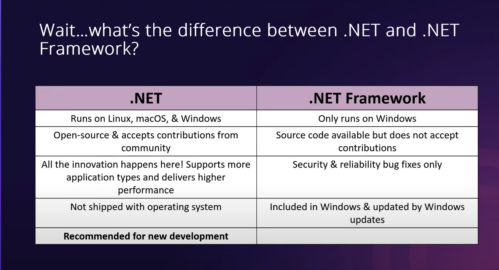

# dot-net-dev

| .NET (V. 5+) | .NET Framework (V. <= 4.8.1) |
| --- | --- |
| Runs on Linux, macOS, & Windows | Only runs on Windows |
| Open-source & accepts contributions from community | Source code available but does not accept contributions |
| All the innovation happens here! Supports more application types and delivers higher performance | Security & reliability bug fixes only |
| Not shipped with operating system | Included in Windows & updated by Windows updates |
| Recommended for new development |  |
